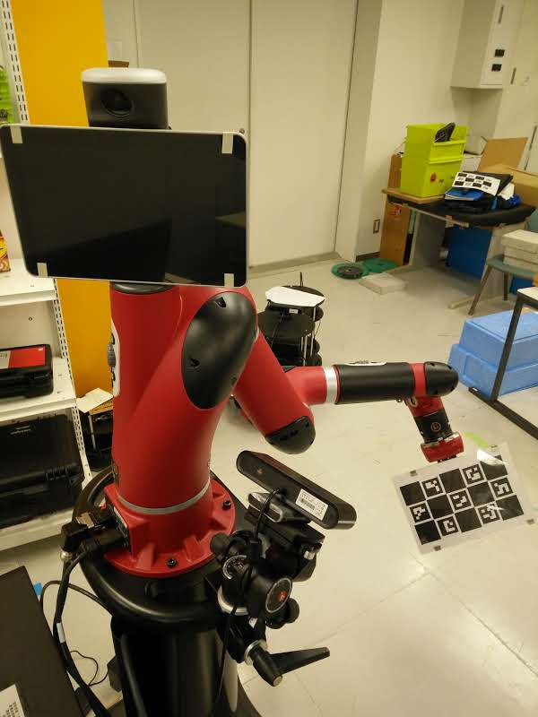

# charuco_board_pose_publisher
This package publishes the pose of a charuco board. Mainly it is used for robot calibration, which is described in the next sections.

# Robot-Camera calibration

This software can be used with any robot and 3D camera. Here, as an example, we use Sawyer robot and an Astra 3D camera.

## Requirements
These packages need to be download and installed

- Camera Drivers:
For Astra, we will need [Astra Camera](https://github.com/orbbec/ros_astra_camera) and [Astra Launch](https://github.com/orbbec/ros_astra_launch).

- Robot Drivers:
For Sawyer, they are found on [RethinkRobotics repository](https://github.com/RethinkRobotics/)

- Camera Calibration algorithm:
We will use [this package](https://github.com/gborghesan/camera_robot_calibration/tree/hydro)


- Board pose publisher (This package).

## Setup
For the calibration you need to attach a charuko marker board to the end effector of the robot.




## Choosing the right frames
The file camera_robot_calibration/launch/capture_points.launch needs to be edited with the appropiate frames for our robot.

For Sawyer, we choose:

```
<arg name="base_frame_name"       default="/base"/>
<arg name="camera_frame_name"     default="/camera_link"/>
<arg name="robot_ee_frame_name"   default="/right_gripper_tip"/>
<arg name="marker_frame_name"     default="/board_frame"/>
```

## Defining the charuco board
In order to detect the charuco board, we need to define in the launchfile the parameters we used to generate the board.

Edit  charuco_board_pose_publisher/launch/board_pose.launch
```
<arg name="squaresX" default="3" />
<arg name="squaresY" default="5" />
<arg name="squareLength" default="0.053" />
<arg name="markerLength" default="0.042" />
<arg name="dictionaryId" default="1" />
```

squaresX, squaresY are the number of squares in each direction of the board. squareLength and markerLength are the lenghts defined in mm. dictionaryId is the dictionary used to generate the board.

## Calibration process
Launch the camera:

    roslaunch astra_launch astra.launch
launch the charuco board pose publisher:

    roslaunch charuco_board_pose_publisher board_pose.launch
launch the calibration algorithm:

    roslaunch  camera_robot_calibration capture_points.launch
launch rviz:

    rviz
    

Now, making sure that the board is being detected (you can see the image in the topic `charuco_board_pose`), move the board to a new position and run the command:

    rosservice call /read_tfs "{}"
to record the board position.

Repeat several times the process of moving the board and recording the position. Then, run:

    rosservice call /compute_frames "{}"
This will update the frames with the new computed frames. You should see how the pointcloud is now aligned with the robot. If it is not yet good enough, keep doing the process of reading the frames.

Once the result looks good, go to the folder `camera_robot_calibration/src/camera_robot_calib/` and run:

    python ./camera_robot_calibration_module.py -i ~/.ros/data.txt
`~/.ros/data.txt` is the default folder where the board positions are stored, if the file is located elsewhere, write the correct path.

After running the program, the camera-robot transformation will appear. Save it, and write it on your launchfile.
  
